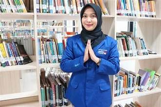
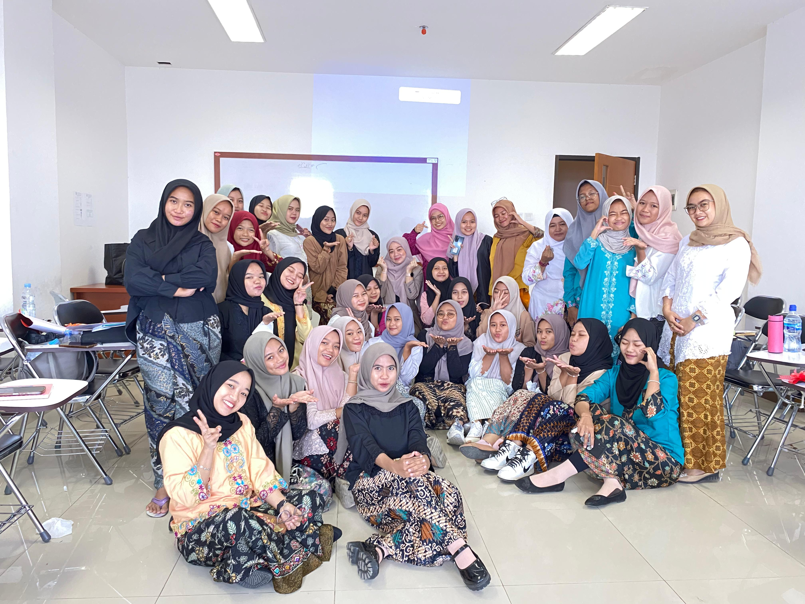
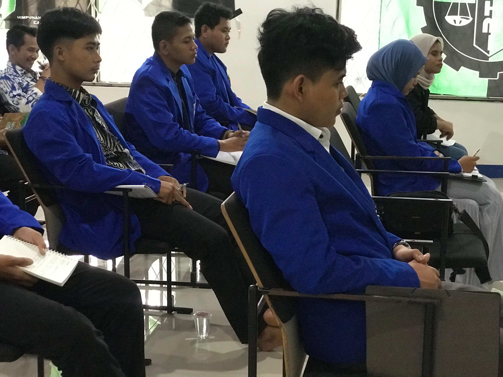

<html class="scroll-smooth" lang="id">
 <head>
  <meta charset="utf-8"/>
  <meta content="width=device-width, initial-scale=1" name="viewport"/>
  <title>
   Himpunan Organisasi - Aplikasi Web Interaktif
  </title>
  
  <link href="https://cdnjs.cloudflare.com/ajax/libs/font-awesome/5.15.3/css/all.min.css" rel="stylesheet"/>
  <link href="https://fonts.googleapis.com/css2?family=Poppins:wght@400;600;700&amp;display=swap" rel="stylesheet"/>
  

 </head>
 <body class="flex flex-col min-h-screen">
  <!-- Navbar -->
  <nav class="fixed w-full z-50 bg-white/90 backdrop-blur-md shadow-lg border-b border-indigo-300">
   

    <a class="text-indigo-700 font-extrabold text-3xl tracking-wide hover:text-indigo-900 transition" href="#home">
     Himpunan
     
      Organisasi
     
    </a>
    

     <a class="hover:text-indigo-600 transition duration-300 relative group" href="#home">
      Home
      
      
     </a>
     <a class="hover:text-indigo-600 transition duration-300 relative group" href="#visi-misi">
      Visi &amp; Misi
      
      
     </a>
     <a class="hover:text-indigo-600 transition duration-300 relative group" href="#kegiatan">
      Kegiatan
      
      
     </a>
     <a class="hover:text-indigo-600 transition duration-300 relative group" href="#galeri">
      Galeri
      
      
     </a>
     <a class="hover:text-indigo-600 transition duration-300 relative group" href="#kritik-saran">
      Kritik &amp; Saran
      
      
     </a>
    

    <button class="hidden md:inline-block bg-indigo-600 hover:bg-pink-600 text-white font-semibold px-5 py-2 rounded-full shadow-lg transition duration-300 focus:outline-none focus:ring-4 focus:ring-pink-400" id="btn-login">
     <i class="fas fa-sign-in-alt mr-2">
     </i>
     Login
    </button>
    <button aria-label="Toggle menu" class="md:hidden text-indigo-700 hover:text-pink-600 focus:outline-none focus:ring-2 focus:ring-pink-400" id="btn-menu">
     <i class="fas fa-bars fa-lg">
     </i>
    </button>
   

   

    <a class="block px-6 py-3 border-b border-indigo-200 hover:bg-indigo-50 font-semibold text-indigo-700" href="#home">
     Home
    </a>
    <a class="block px-6 py-3 border-b border-indigo-200 hover:bg-indigo-50 font-semibold text-indigo-700" href="#visi-misi">
     Visi &amp; Misi
    </a>
    <a class="block px-6 py-3 border-b border-indigo-200 hover:bg-indigo-50 font-semibold text-indigo-700" href="#kegiatan">
     Kegiatan
    </a>
    <a class="block px-6 py-3 border-b border-indigo-200 hover:bg-indigo-50 font-semibold text-indigo-700" href="#galeri">
     Galeri
    </a>
    <a class="block px-6 py-3 border-b border-indigo-200 hover:bg-indigo-50 font-semibold text-indigo-700" href="#kritik-saran">
     Kritik &amp; Saran
    </a>
    <button class="w-full text-left px-6 py-3 font-semibold text-pink-600 hover:bg-pink-50 transition" id="btn-login-mobile">
     <i class="fas fa-sign-in-alt mr-2">
     </i>
     Login
    </button>
   

  </nav>
  <!-- Hero Section -->
  <section class="pt-24 pb-20 bg-gradient-to-r from-indigo-700 via-pink-600 to-indigo-700 text-white" id="home">
   

    

     <h1 class="text-5xl font-extrabold leading-tight drop-shadow-lg">
      Selamat Datang di
       
      
       Himpunan Organisasi
      
     </h1>
     

      Wadah kolaborasi, inovasi, dan pengembangan diri untuk kemajuan
          bersama. Bergabunglah dan jadilah bagian dari perubahan positif!
     

     <a class="inline-block bg-pink-500 hover:bg-pink-600 transition rounded-full px-8 py-3 font-semibold shadow-lg drop-shadow-lg" href="#kritik-saran">
      Berikan Kritik &amp; Saran
     </a>
    

    

     
    

   

  </section>
  <!-- Visi & Misi Section -->
  <section class="max-w-5xl mx-auto px-6 sm:px-8 lg:px-12 py-20 bg-white rounded-3xl shadow-2xl -mt-20 relative z-10" id="visi-misi">
   <h2 class="text-4xl font-extrabold text-indigo-700 mb-12 text-center">
    Visi &amp; Misi Kami
   </h2>
   

    

     <h3 class="text-3xl font-bold text-pink-600 border-b-4 border-pink-400 inline-block pb-2">
      Visi
     </h3>
     

      Menjadi himpunan organisasi terdepan yang inovatif, inklusif, dan
          berkontribusi nyata dalam pembangunan masyarakat yang berkelanjutan.
     

    

    

     <h3 class="text-3xl font-bold text-indigo-700 border-b-4 border-indigo-400 inline-block pb-2">
      Misi
     </h3>
     <ul class="list-disc list-inside text-gray-700 space-y-3 text-lg leading-relaxed">
      <li>
       Mendorong partisipasi aktif anggota dalam berbagai kegiatan sosial
            dan pengembangan diri.
      </li>
      <li>
       Membangun jaringan kerja sama yang kuat dengan berbagai pihak
            terkait.
      </li>
      <li>
       Menyelenggarakan program-program yang mendukung pengembangan
            kapasitas anggota.
      </li>
      <li>
       Mengembangkan budaya organisasi yang transparan, akuntabel, dan
            profesional.
      </li>
     </ul>
    

   

  </section>
  <!-- Kegiatan Section -->
  <section class="max-w-7xl mx-auto px-6 sm:px-8 lg:px-12 py-20" id="kegiatan">
   <h2 class="text-4xl font-extrabold text-indigo-700 mb-12 text-center">
    Kegiatan Terbaru
   </h2>
   

    <article class="bg-white rounded-3xl shadow-xl overflow-hidden transform hover:scale-105 transition-transform duration-300 cursor-pointer" tabindex="0">
     
     

      <h3 class="text-2xl font-semibold text-indigo-700 mb-3">
       Workshop Pengembangan Diri
      </h3>
      

       Workshop intensif untuk meningkatkan soft skills anggota dalam
            komunikasi dan kepemimpinan.
      

      <time class="text-sm text-gray-400 font-mono tracking-wide" datetime="2024-05-10">
       10 Mei 2024
      </time>
     

    </article>
    <article class="bg-white rounded-3xl shadow-xl overflow-hidden transform hover:scale-105 transition-transform duration-300 cursor-pointer" tabindex="0">
     
     

      <h3 class="text-2xl font-semibold text-indigo-700 mb-3">
       Pengabdian Masyarakat
      </h3>
      

       Program rutin membantu masyarakat sekitar dengan edukasi dan
            bantuan sosial.
      

      <time class="text-sm text-gray-400 font-mono tracking-wide" datetime="2024-04-22">
       22 April 2024
      </time>
     

    </article>
    <article class="bg-white rounded-3xl shadow-xl overflow-hidden transform hover:scale-105 transition-transform duration-300 cursor-pointer" tabindex="0">
     
     

      <h3 class="text-2xl font-semibold text-indigo-700 mb-3">
       Seminar Teknologi Inovatif
      </h3>
      

       Seminar membahas tren teknologi terbaru dan peluang inovasi di era
            digital.
      

      <time class="text-sm text-gray-400 font-mono tracking-wide" datetime="2024-03-15">
       15 Maret 2024
      </time>
     

    </article>
   

  </section>
  <!-- Galeri Section -->
  <section class="max-w-7xl mx-auto px-6 sm:px-8 lg:px-12 py-20 bg-gradient-to-tr from-indigo-50 to-pink-50 rounded-3xl shadow-2xl" id="galeri">
   <h2 class="text-4xl font-extrabold text-indigo-700 mb-12 text-center">
    Galeri Foto &amp; Video
   </h2>
   

    
    
    
    
    
    
   

   

    <iframe allow="accelerometer; autoplay; clipboard-write; encrypted-media; gyroscope; picture-in-picture" allowfullscreen="" class="w-full h-full" frameborder="0" src="vidio fb.mp4" title="Video dokumentasi kegiatan himpunan organisasi">
    </iframe>
   

  </section>
  <!-- Kritik & Saran Section -->
  <section class="max-w-3xl mx-auto px-6 sm:px-8 lg:px-12 py-20 bg-white rounded-3xl shadow-2xl" id="kritik-saran">
   <h2 class="text-4xl font-extrabold text-indigo-700 mb-10 text-center">
    Kritik &amp; Saran
   </h2>
   <form action="simpan.php" class="space-y-8" id="feedback-form" >
    

     <label class="block text-gray-700 font-semibold mb-2 text-lg" for="name">
      Nama 
     </label>
     <input class="w-full border border-indigo-300 rounded-xl px-4 py-3 focus:outline-none focus:ring-4 focus:ring-pink-300 transition" id="name" name="nama" placeholder="Masukkan nama Anda" required="" type="text"/>
    

    

     <label class="block text-gray-700 font-semibold mb-2 text-lg" for="email">
      Email
     </label>
     <input class="w-full border border-indigo-300 rounded-xl px-4 py-3 focus:outline-none focus:ring-4 focus:ring-pink-300 transition" id="email" name="email" placeholder="Masukkan email Anda" required="" type="email"/>
    

    

     <label class="block text-gray-700 font-semibold mb-2 text-lg" for="role">
      Peran Anda
     </label>
     <select class="w-full border border-indigo-300 rounded-xl px-4 py-3 focus:outline-none focus:ring-4 focus:ring-pink-300 transition" id="role" name="peranan_anda" required="">
      <option disabled="" selected="" value="">
       Pilih peran Anda
      </option>
      <option value="anggota">
       Anggota
      </option>
      <option value="pengurus">  
       Pengurus
      </option>
      <option value="pengunjung">
       Pengunjung
      </option>
      <option value="lainnya">
       Lainnya
      </option>
     </select>
    

    

     <label class="block text-gray-700 font-semibold mb-2 text-lg" for="message">
      Kritik &amp; Saran
     </label>
     <textarea class="w-full border border-indigo-300 rounded-xl px-4 py-3 focus:outline-none focus:ring-4 focus:ring-pink-300 transition resize-none" id="saran" name="saran" placeholder="Tuliskan kritik dan saran Anda untuk kemajuan organisasi" required="" rows="5"></textarea>
    

    <button class="w-full bg-pink-600 hover:bg-pink-700 text-white font-extrabold py-4 rounded-full shadow-lg transition duration-300 focus:outline-none focus:ring-4 focus:ring-pink-400" type="submit">
     Kirim
    </button>
   </form>
   

    Terima kasih atas kritik dan saran Anda!
   

  </section>
  <!-- Footer -->
  <footer class="bg-indigo-900 text-indigo-200 py-8 mt-auto">
   

    

     © 2024 Himpunan Organisasi. All rights reserved.
    

    

     Dibuat dengan ❤️ oleh Tim Pengembang Himpunan Organisasi
    

   

  </footer>
  <!-- Login Modal -->
  

   

    <button aria-label="Close login modal" class="absolute top-5 right-5 text-gray-500 hover:text-pink-600 focus:outline-none focus:ring-2 focus:ring-pink-400 rounded-full p-1 transition" id="btn-close-login">
     <i class="fas fa-times fa-lg">
     </i>
    </button>
    <h3 class="text-3xl font-extrabold text-indigo-700 mb-8 text-center" id="login-modal-title">
     Login Himpunan Organisasi
    </h3>
    

     <button aria-pressed="true" class="px-6 py-3 rounded-full font-semibold shadow-lg bg-indigo-600 text-white hover:bg-pink-600 transition focus:outline-none focus:ring-4 focus:ring-pink-400" id="btn-login-admin">
      Admin
     </button>
     <button aria-pressed="false" class="px-6 py-3 rounded-full font-semibold shadow-lg bg-gray-300 text-gray-700 hover:bg-gray-400 transition focus:outline-none focus:ring-4 focus:ring-pink-400" id="btn-login-anggota">
      Anggota
     </button>
    

    <form class="space-y-6" id="login-form" novalidate="">
     

      <label class="block text-gray-700 font-semibold mb-2 text-lg" for="username">
       Username
      </label>
      <input autocomplete="username" class="w-full border border-indigo-300 rounded-xl px-4 py-3 focus:outline-none focus:ring-4 focus:ring-pink-300 transition" id="username" name="username" placeholder="Masukkan username" required="" type="text"/>
     

     

      <label class="block text-gray-700 font-semibold mb-2 text-lg" for="password">
       Password
      </label>
      <input autocomplete="current-password" class="w-full border border-indigo-300 rounded-xl px-4 py-3 focus:outline-none focus:ring-4 focus:ring-pink-300 transition" id="password" name="password" placeholder="Masukkan password" required="" type="password"/>
     

     <button class="w-full bg-pink-600 hover:bg-pink-700 text-white font-extrabold py-4 rounded-full shadow-lg transition duration-300 focus:outline-none focus:ring-4 focus:ring-pink-400" type="submit">
      Masuk
     </button>
    </form>
    

    

   

  

  
 </body>
</html>
